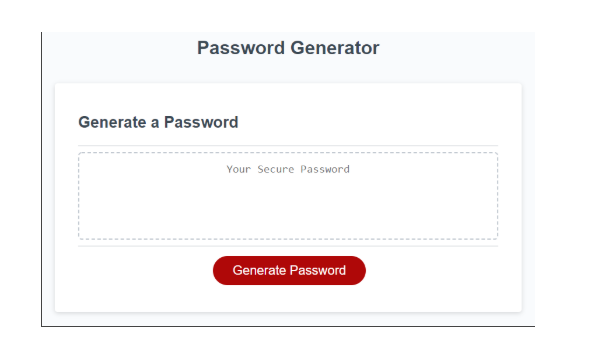

# Password Generator Starter Code for Assignment for Module 3
# This code generates a password for a given number of characters and 4 different options for character type (upper case letter, lower case letter, number and/or special character
